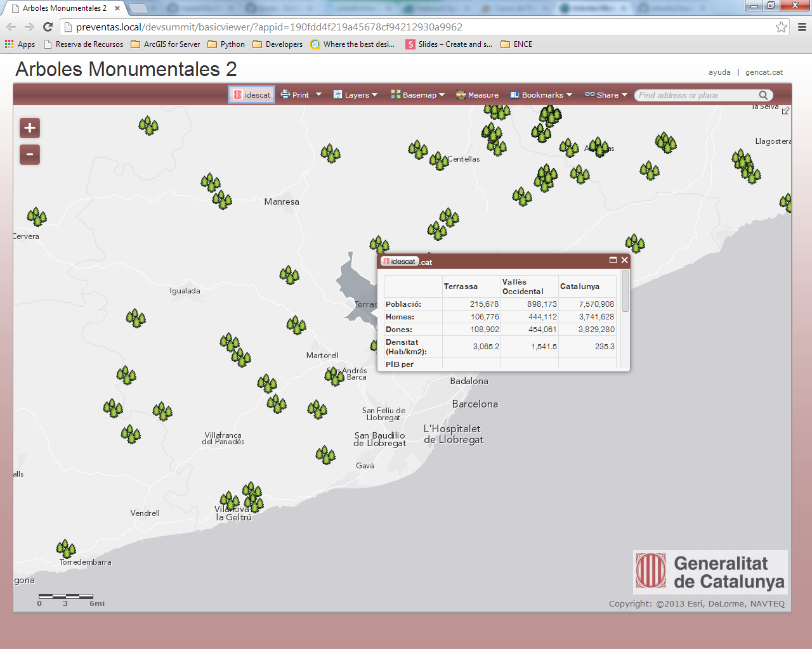

#basicviewer
##Introducción
Este repositorio contiene una versión de la plantilla de aplicación 'basicviewer' de ArcGIS Online personalizada para un cliente (demo).

[ver online](http://jabadia.github.io/basicviewer/?appid=190fdd4f219a45678cf94212930a9962)

La personalización incluye:

* logotipo de la organización
* colores corporativos
* enlaces personalizados (esq. superior derecha)
* funcionalidad personalizada (botón idescat), que permite consultar un servicio REST del Departamento de Estadística de la Generalitat de Catalunya para obtener valores estadísticos sobre los municipios catalanes.

La funcionalidad básica de la plantilla incluye:

* abrir cualquier mapa de ArcGIS Online mediante su webmapid
* imprimir mapas
* activar/desactivar capas
* cambiar los mapas base
* medir distancias y áreas
* acceder a los bookmarks almacenados en el webmap
* acceder a los atributos de las entidades (pop-ups) tal y como están configurados en el webmap
* buscar lugares
* editar (si las capas tienen los permisos adecuados)  

Este código es un ejemplo de plantilla de aplicaciones personalizada a medida de una organización

##Instalación y Configuración
_POR HACER_

##Más información
_POR HACER_

  